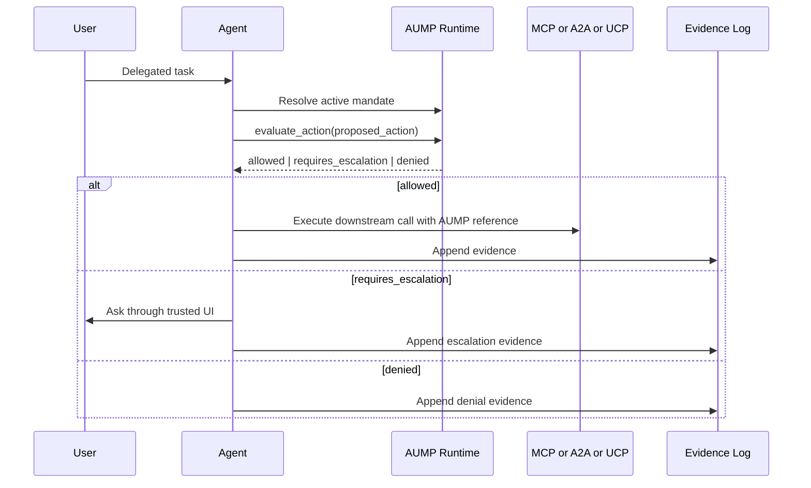

# Agent Loop Integration

An agentic system should use AUMP as a runtime guardrail, not as prompt text
alone. The LLM can plan, but the runtime decides whether a proposed action is
allowed.

## Basic Loop



## Python Shape

```python
decision = runtime.evaluate_action(mandate_id, proposed_action)

if decision["decision"] == "allowed":
    result = await call_tool_or_agent(proposed_action)
elif decision["decision"] == "requires_escalation":
    result = await request_trusted_review(decision)
else:
    result = {"blocked": True, "reason_codes": decision["reason_codes"]}

runtime.append_evidence(
    mandate_id,
    "material_action_evaluated",
    proposed_action["summary"],
    decision["decision"],
    {"reason_codes": decision["reason_codes"]},
)
```

## A2A Message Shape

When an agent sends an A2A message, the runtime should attach only a mandate
reference. The full private mandate remains local.

```python
outbound = runtime.a2a_message(
    mandate_id,
    message_id="msg_offer_001",
    role="user",
    parts=[{"text": "I can offer 3 USD."}],
)

validation = receiver_runtime.validate_a2a_message(outbound)
if not validation["valid"]:
    return {"blocked": True, "errors": validation["errors"]}
```

The receiving runtime checks the bridge shape, resolves the mandate reference
when it can, and rejects hash mismatches or embedded private mandates before
writing seller-side evidence.

## TypeScript Shape

```ts
const decision = evaluateAction(mandate, proposedAction, { now, context });

if (decision.decision === "allowed") {
  await callToolOrAgent(proposedAction);
} else if (decision.decision === "requires_escalation") {
  await requestTrustedReview(decision);
} else {
  return { blocked: true, reason_codes: decision.reason_codes };
}
```

## Material Action Checklist

Call `evaluate_action` before:

- outbound A2A messages that include offers, acceptance, commitments, or private
  details;
- MCP tool calls that change external state or expose private context;
- UCP checkout, cart, or order transitions;
- AP2 intent, cart, or payment mandate handoff;
- any disclosure derived from protected mandate fields;
- any step that consumes budget, creates liability, or changes user-facing
  obligations.

## Prompting Is Not Enforcement

Prompt text can explain the user's wishes to a model, but it cannot provide a
deterministic audit boundary. AUMP enforcement must happen in code, outside the
LLM output channel.

An LLM API key is not needed to prove the conformance boundary. Keys are only
needed when testing model quality, negotiation behavior, prompt-injection
resistance, or provider-specific tool calling on top of this runtime loop.
