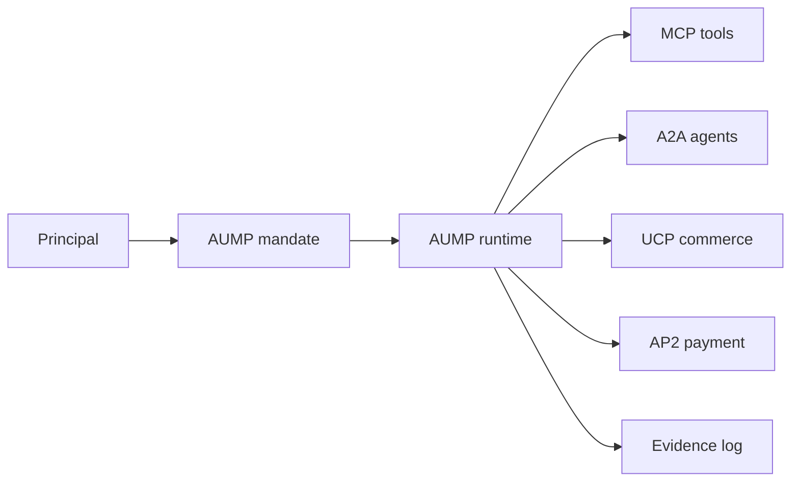

---
hide:
  - toc
---

# Agentic User Mandate Protocol

AUMP is the user mandate layer for agentic systems. It gives agents a portable,
machine-readable contract for the authority, preferences, disclosure limits,
negotiation policy, escalation conditions, and evidence obligations of the
principal they represent.

!!! warning "Working draft"
    AUMP v0.1 is a protocol candidate and conformance workstream, not a final
    standard. The current goal is to harden the contract through schemas,
    runnable conformance, SDK parity, and end-to-end examples.

MCP gives agents tools. A2A gives agents a way to discover and communicate with
other agents. UCP describes commerce capabilities and checkout surfaces. AP2
anchors payment authorization. AUMP sits before those actions and answers a
different question: what is this agent allowed to do for this user right now?

<div class="grid cards" markdown>

- **Learn the model**

    Understand the actors, mandate lifecycle, runtime boundary, and enterprise
    deployment responsibilities.

    [What is AUMP?](topics/what-is-aump.md)

- **Integrate an agent**

    Put AUMP into the LLM loop before tools, agent messages, checkout, and
    payment handoff.

    [Agent loop integration](getting-started/agent-loop.md)

- **Read the specification**

    Review mandate fields, action evaluation, evidence, and binding rules.

    [Specification overview](specification/overview.md)

- **Run conformance**

    Validate schemas, policy decisions, bridge metadata, and runtime boundaries.

    [Conformance suite](conformance/index.md)

</div>

## Protocol Stack



## Current Implementation State

| Area | Status | Repository |
| --- | --- | --- |
| Specification | Draft v0.1 with mandate, profile, action-evaluation, and evidence-event schemas | [spec](https://github.com/Agentic-User-Mandate-Protocol/spec) |
| Conformance | Native Go runner plus Python parity runner, 29 fixture cases | [conformance](https://github.com/Agentic-User-Mandate-Protocol/conformance) |
| Python SDK | Schema validation, policy evaluation, canonical evidence events, evidence semantics, bridge helpers, runtime | [aump-py](https://github.com/Agentic-User-Mandate-Protocol/aump-py) |
| TypeScript SDK | Schema validation, policy evaluation, evidence-event schema and semantic validation, bridge helpers | [aump-js](https://github.com/Agentic-User-Mandate-Protocol/aump-js) |
| Examples | Deterministic marketplace proof over conformance fixtures | [examples](https://github.com/Agentic-User-Mandate-Protocol/examples) |

## Design Rule

AUMP is not a payment protocol, a tool protocol, an agent transport, or an
identity system. It is the mandate and enforcement layer that those systems can
reference before an agent takes a material step.

The first runtime rule is simple:

```text
plan -> propose action -> evaluate_action -> act, escalate, or deny -> evidence
```

If an implementation cannot prove that every material action passed through
that boundary, it is not enforcing AUMP yet.
