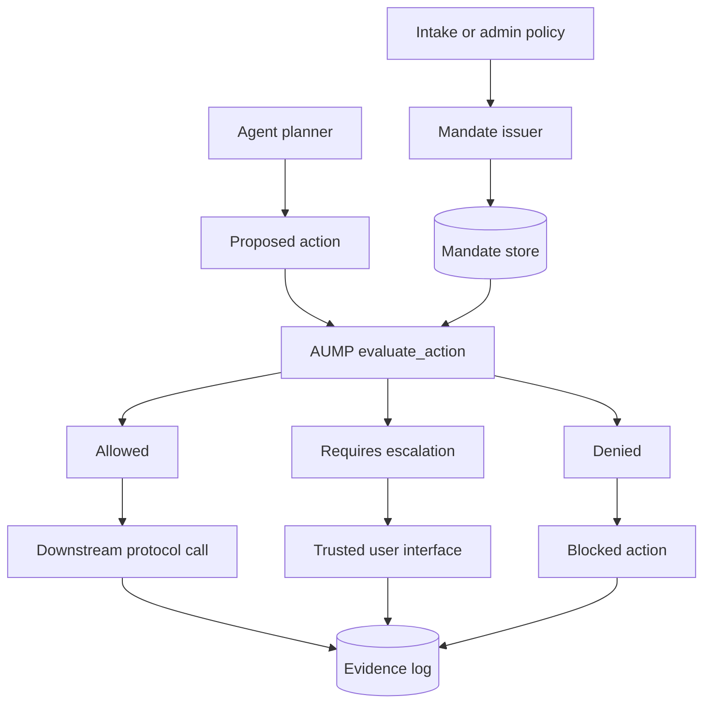

# Architecture

AUMP is a control plane for delegated agent action. The agent may still reason
with an LLM, call MCP tools, send A2A messages, or initiate UCP/AP2 commerce
flows, but those actions pass through an AUMP runtime boundary first.

## Actors

| Actor | Role |
| --- | --- |
| Principal | The represented user, organization, household, or other authority source. |
| Issuer | Creates the mandate from intake, policy, or account configuration. |
| Agent | Plans and proposes actions under the mandate. |
| Runtime | Resolves mandates, evaluates actions, enforces decisions, and appends evidence. |
| Counterparty | External party reached through A2A, UCP, MCP, REST, or another protocol. |
| Verifier | Checks schema validity, hashes, signatures, status, expiry, and evidence. |

## Components



## Control Boundary

The AUMP runtime boundary sits between planning and external effects:

```text
LLM plan
  -> proposed action
  -> evaluate_action(mandate, action, context)
  -> allowed | requires_escalation | denied
  -> downstream protocol call or trusted review
  -> evidence event
```

The downstream protocol does not need the full private mandate. It only needs a
safe reference, such as a mandate ID, hash, URL, and version.

## Data Boundaries

| Data | May leave the runtime? | Notes |
| --- | --- | --- |
| Mandate ID | Yes | Safe identifier when scoped to a platform. |
| Mandate hash | Yes | Lets counterparties bind evidence without reading private policy. |
| Mandate URL | Sometimes | Use only when resolution is intended and access controlled. |
| Public summary | Sometimes | May be disclosed when policy allows. |
| Private preferences | No by default | Examples: reservation price, private notes, hard walk-away terms. |
| Evidence summary | Yes, scoped | Prefer summaries and hashes over raw private content. |

## Enterprise Deployment Model

In enterprise systems, AUMP should run as one of three deployment shapes:

| Shape | Use when | Tradeoff |
| --- | --- | --- |
| In-process SDK | Single application agent runtime. | Lowest latency, easiest to adopt, harder to govern centrally. |
| Sidecar service | Multiple agents on one platform. | Shared policy and evidence without cross-org coupling. |
| Mandate authority service | Enterprise or marketplace-wide control plane. | Strong governance and audit, requires availability planning. |

The conformance suite should be mandatory in CI for every implementation shape.
