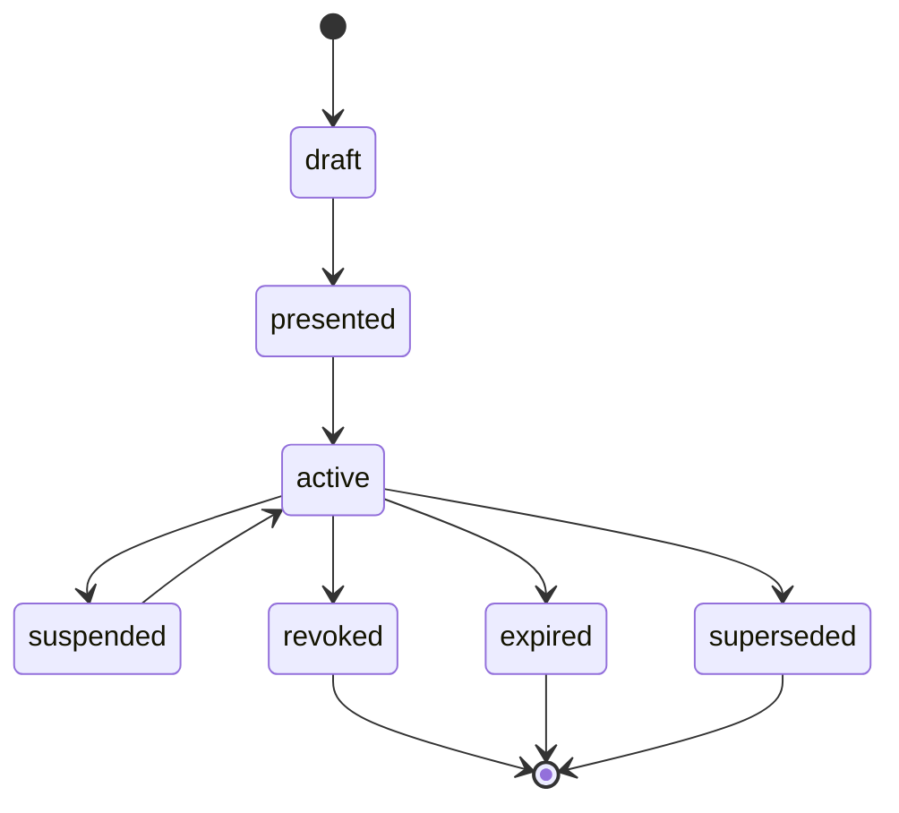

# Life of a Mandate

AUMP treats mandate state as an enforcement boundary, not a display label.

## Lifecycle States

| State | Autonomous action allowed? | Meaning |
| --- | --- | --- |
| `draft` | No | Created but not accepted. |
| `presented` | No | Shown to the principal but not active. |
| `active` | Yes, within scope | Usable for autonomous action. |
| `suspended` | No | Temporarily inactive. |
| `revoked` | No | Permanently inactive. |
| `expired` | No | Past `expires_at`. |
| `superseded` | No | Replaced by a newer mandate. |

## Flow

## Activation Requirements

Before a runtime may act autonomously, it must verify:

- schema validity;
- status is `active`;
- `issued_at` and `expires_at` are valid;
- authority mode and objective bounds are present;
- the action is inside purpose and permission scope;
- revocation is not known;
- disclosure policy is enforceable;
- escalation policy is enforceable.

## Revocation

Runtimes must stop autonomous action as soon as revocation is known. If a
runtime cannot check revocation live, it should use short-lived mandates and
append evidence that identifies the revocation freshness policy used.

## Supersession

When a mandate is superseded, downstream references should include the old
mandate ID and the new active mandate ID in evidence. This lets reviewers
explain which policy controlled each action.
